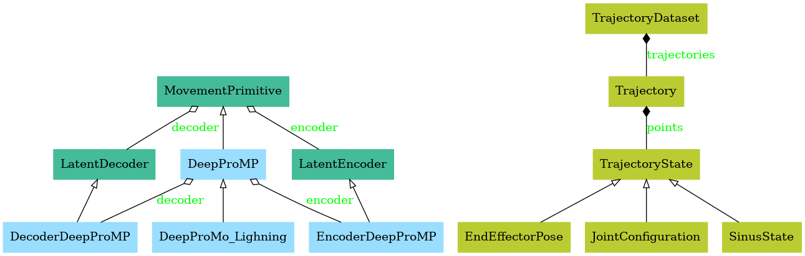

[](https://github.com/SamuelePolimi/moppy/actions/workflows/run-tests.yml)

# moppy

MoPPy is a python library that implements several movement primitives for robotics.

<!---
pyreverse -o png --colorized -k moppy
-->


## Getting started

Install the library with

```bash
pip install .
```

You can now use this library in another project!

## Examples

Take a look in the [example folder](examples/), where you can find multiple implementations showcasing the functionality of the library.

## Development

### Creating the conda enviroment

```bash
    conda env create -f environment.yml
    conda activate moppy
```

Then install the library in editable mode

```bash
pip install -e .
```

### Testing

- All the tests can be found in the [tests](/tests/) folder.
- There exists a ci for testings.
- For mor information on testing in moppy follow [README.md](/tests/README.md).


### Local development docs

Install necessary packages:

```bash
pip install mkdocs
pip install mkdocs-material
```

Start local server:

```bash
mkdocs serve
```

---

## Our documentation Link:

<https://samuelepolimi.github.io/moppy/>
