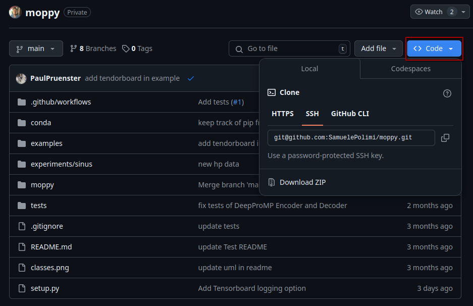

# Documentation

MoPPy is a python library that implements several movement primitives for robotics.

## 1. Testing Status

[](https://github.com/SamuelePolimi/moppy/actions/workflows/run-tests.yml)

## 2. Getting Started

!!! Warning

    Moppy is currently a **private Python package**, which means it **cannot be installed from the Python Package Index (PyPI) or other public repositories**. Instead, you can install it directly from the GitHub repository.

### 2.1 Install the Library from GitHub

#### 2.1.1 Install the Library from GitHub



To install Moppy, use the following command in your terminal. Make sure you have cloned the repository to your local machine or are in the root directory of the cloned repository.

```bash
pip install .
```

#### 2.1.2 Continuous Development

If you're actively developing Moppy and want to make changes to the code, you can install it in "editable" mode using the ***-e*** flag. This allows you to modify the source code and have those changes reflected immediately without needing to reinstall the package.

To install Moppy in editable mode, use the following command:

```bash
pip install -e .
```

#### 2.1.3 Alternative: Installing Directly from GitHub

If you prefer to install Moppy directly from GitHub without cloning the repository, you can use the following command, replacing USERNAME with your GitHub username and REPO with the repository name:

```bash
pip install git+https://github.com/SamuelePolimi/moppy.git
```

You can now use this library in another project!

### 2.2 Creating the conda enviroment

If you want to use a conda enviroment, you can create the envirement using following command:

```bash
conda env create -f environment.yml
conda activate moppy
```

## 3. Examples

Take a look in the [example folder](examples/), where you can find multiple implementations showcasing the functionality of the library.

## 4. Testing

- All the tests can be found in the [tests](/tests/) folder.
- There exists a ci for testings.
- For mor information on testing in moppy follow [README.md](/tests/README.md).
